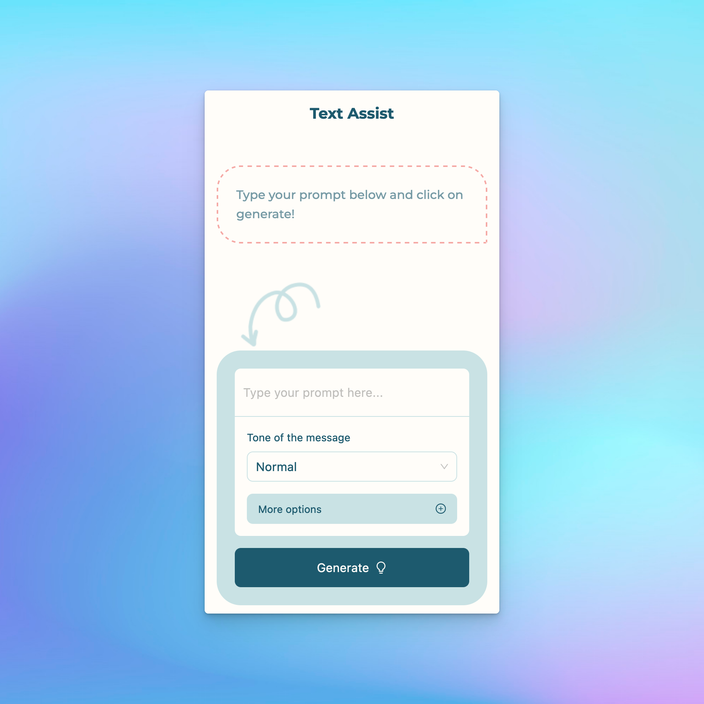
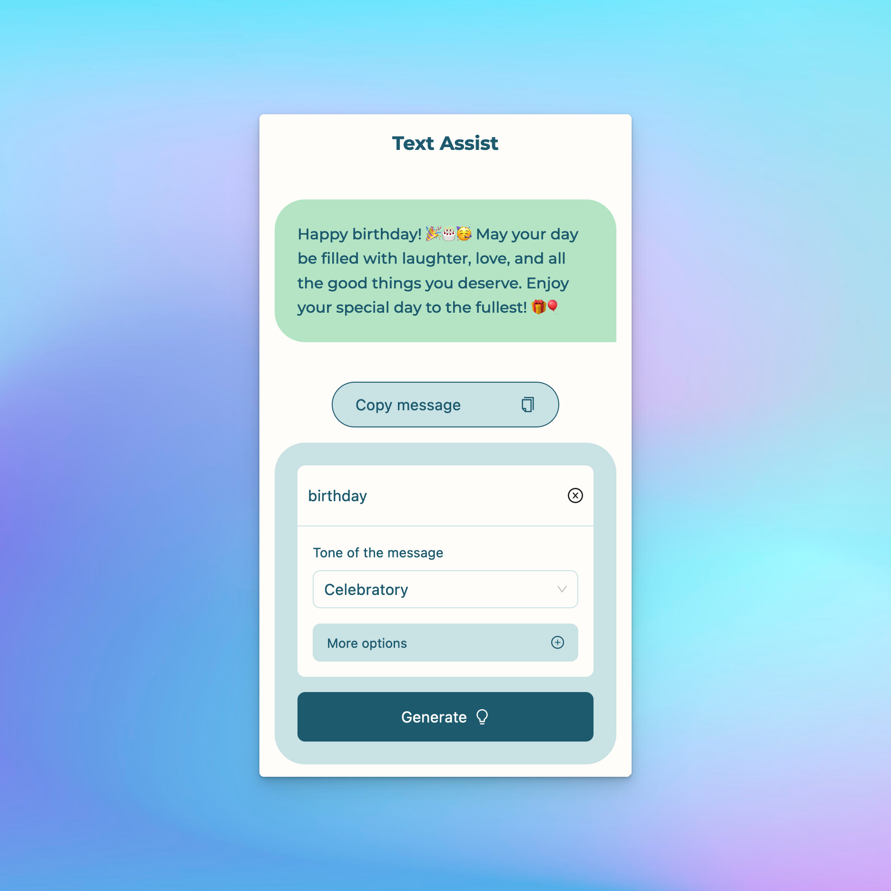

# Text Assist
Let AI generate the text messages for you!

### _Important note_

_As this project is intended as a side project and a learning experience, it uses free-tier OpenAI API, which might cause the application to display an error state page and not generate the intended message. Apologies in advance._

## Demo link:

Try out the application at [text-assist.vercel.app](https://text-assist.vercel.app)

## Table of Content:

- [About The App](#about-the-app)
- [Screenshots](#screenshots)
- [Technologies](#technologies)
- [Setup](#setup)

## About The App

Text assist is an application that can generate messages for the user-provided prompt. It uses AI ([OpenAI](https://openai.com/)) to generate the message. Users can also adjust options such as the tone of the message, language, style (casual, semi-formal, formal), length and whether to include emojis or not. After a message is generated, the user can copy the message with a single click and is ready to paste it anywhere.

## Screenshots

  

  

  

## Technologies

- [Next.js](https://nextjs.org/)
- [OpenAI API](https://platform.openai.com/overview)
- [Ant Design](https://ant.design/)
- [TailwindCSS](https://tailwindcss.com/)
- [Styled components](https://styled-components.com/)

## Setup

- Download or clone the repository
- Run "`npm install`"
- Run "`npm run dev`"
- The project will be running on `http://localhost:3000/`
