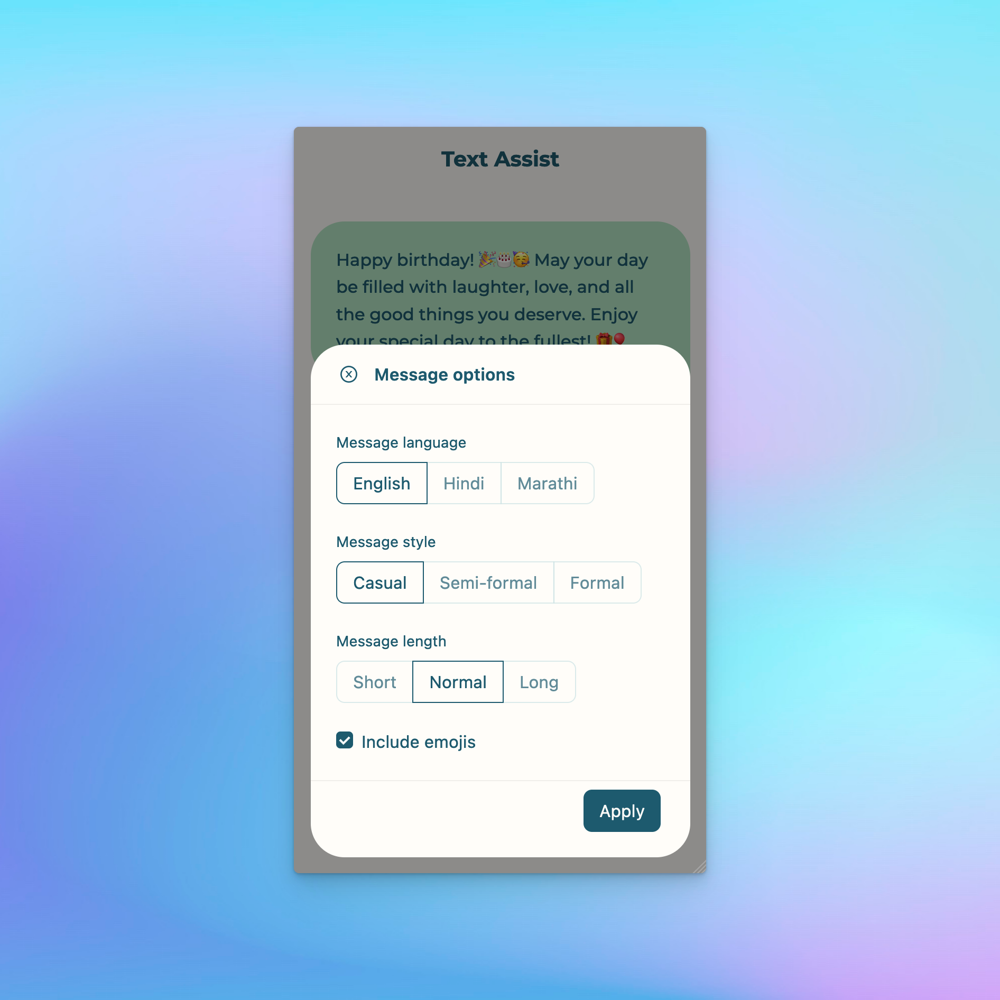

# Text Assist

## Demo link:

Try out the application at [text-assist.vercel.app](https://text-assist.vercel.app)

## Table of Content:

- [About The App](#about-the-app)
- [Screenshots](#screenshots)
- [Technologies](#technologies)
- [Setup](#setup)

## About The App

Text assist is an application that can generate messages for the user-provided prompt. It uses AI ([OpenAI](https://openai.com/)) to generate the message. User can also adjust options such as tone of the message, language, style (casual, semi-formal, formal), length and whether to include emojis or not. After a message is generated, user can copy the message with single click and is ready to paste anywhere.

## Screenshots

## Technologies

- [Next.js](https://nextjs.org/)
- [OpenAI API](https://platform.openai.com/overview)
- [Ant Design](https://ant.design/)
- [Styled components](https://styled-components.com/)

## Setup

- Download or clone the repository
- Run "`npm install`"
- Run "`npm run dev`"
- The project will be running on `http://localhost:3000/`
